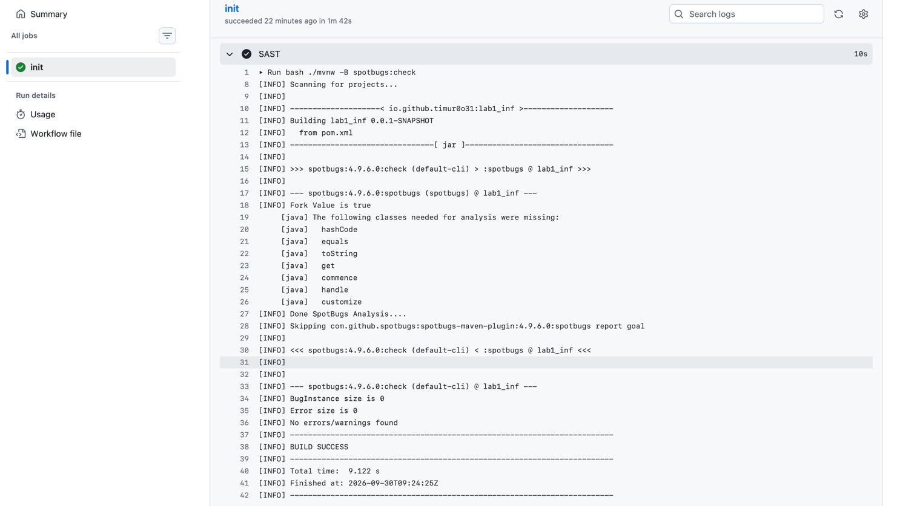
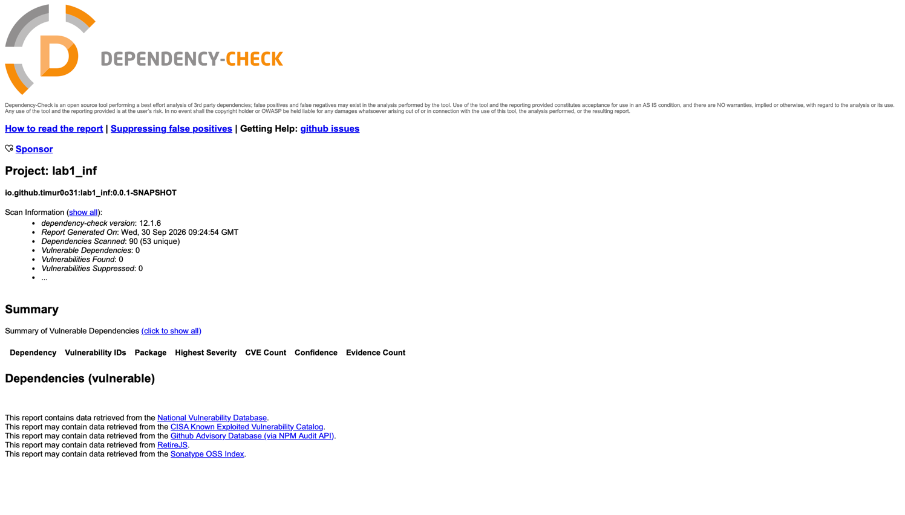

# inf-sec
Лабораторная работа №1 по дисциплине "Информационная безопасность".\
API поддерживает регистрацию, вход и получение списка пользователей.
Доступ к списку пользователей разрешён только после аутентификации
по JWT.
### Стек
Java 17. Spring boot, Spring Security, PostgreSQL, Maven

## Описание API
Регистрация и вход доступны без JWT. Для получения списка пользователей
необходимо передать в заголовок токен.


| Метод | Путь | Доступ | Назначение |
|---|---|---|---|
| `POST` | `/auth/register` | Открыт | Регистрация пользователя и выдача JWT |
| `POST` | `/auth/login` | Открыт | Проверка логина и пароля, выдача JWT |
| `GET` | `/api/data` | JWT | Получение списка пользователей: ID и имя |

Для запросов /auth/register и /auth/login. Тело запроса — JSON:
#### `POST /auth/register`
```json
{
  "username": "timur",
  "password": "12345678"
}
```
##### `POST /auth/login`
```json
{
"username": "timur",
"password": "12345678"
}
```
#### GET `/api/data` - в заголовке задается Authorization
```http
Authorization: Bearer <token>
```

## Описание реализованных мер защиты
- Для защиты от  SQLi используется ORM Hibernate
- Для защиты от XSS используется экранирование данных через HtmlUtils.htmlEscape()
- Для аутентификации используется логин и пароль. При регистрации пароль хэшируется с помощью BCrypt, и в бд сохраняется его хэш.
- При входе AuthenticationManager проверяет учётные данные, после чего сервер выдаёт JWT с именем пользователя, временем выдачи и сроком действия. Токен подписывается алгоритмом HS256 с секретным ключом сервера.
- Фильтр JwtFilter через JwtUtils проверяет подпись и срок действия токена
## Скриншоты отчетов SAST/SCA




### Статус CI
[](https://github.com/timur0o31/inf-sec/actions/workflows/ci.yml)